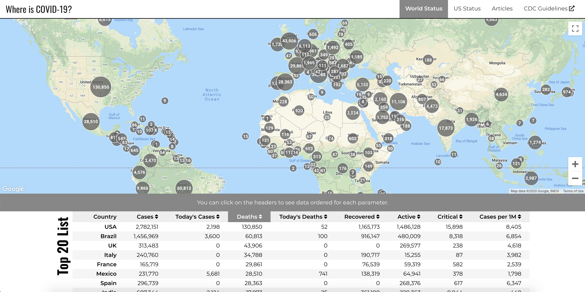

# whereiscovid

 

A COVID19 tracking app. This app provides recent information about Coronavirus while visualizing data on Google Maps.

**Demo:** http://whereiscovid.info

:cyclone: Landing page provides current day's information of the country or state you are in.

:earth_africa: You can check out world's data from the World Status tab.

:earth_americas: You can look at US data and check out individual statuses of the states from the US Status tab.

:earth_africa: You can visualize each of the data bars on the map by simply clicking to them. The table under the map gives the numbers and the first 20 of the countries that are the most effected.

:microscope: From the publications tab, you can review the latest articles that were published about COVID19.

## Main Technologies and API's Used:

1. [React.js](https://reactjs.org/)
2. [react-router-dom](https://www.npmjs.com/package/react-router-dom)
3. [novelcovid API](https://github.com/novelcovid/api)
4. [pubmed API](https://www.ncbi.nlm.nih.gov/home/develop/api/)
5. [GeoIP](http://ip-api.com/json/)

All contributions are welcome and encouraged.

:mask: Stay home as much as possible, wear a mask, listen to your scientists and doctors. We will get through this. Stay safe!
